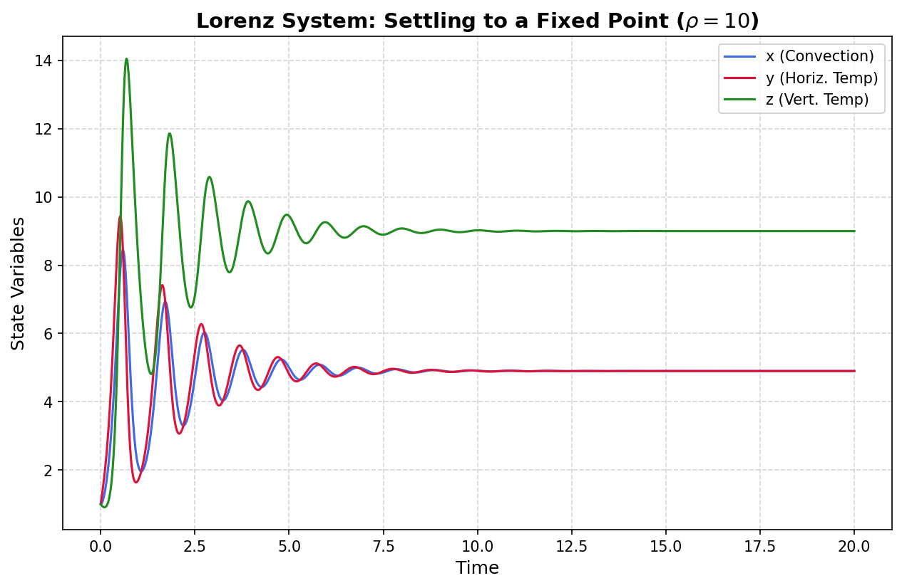
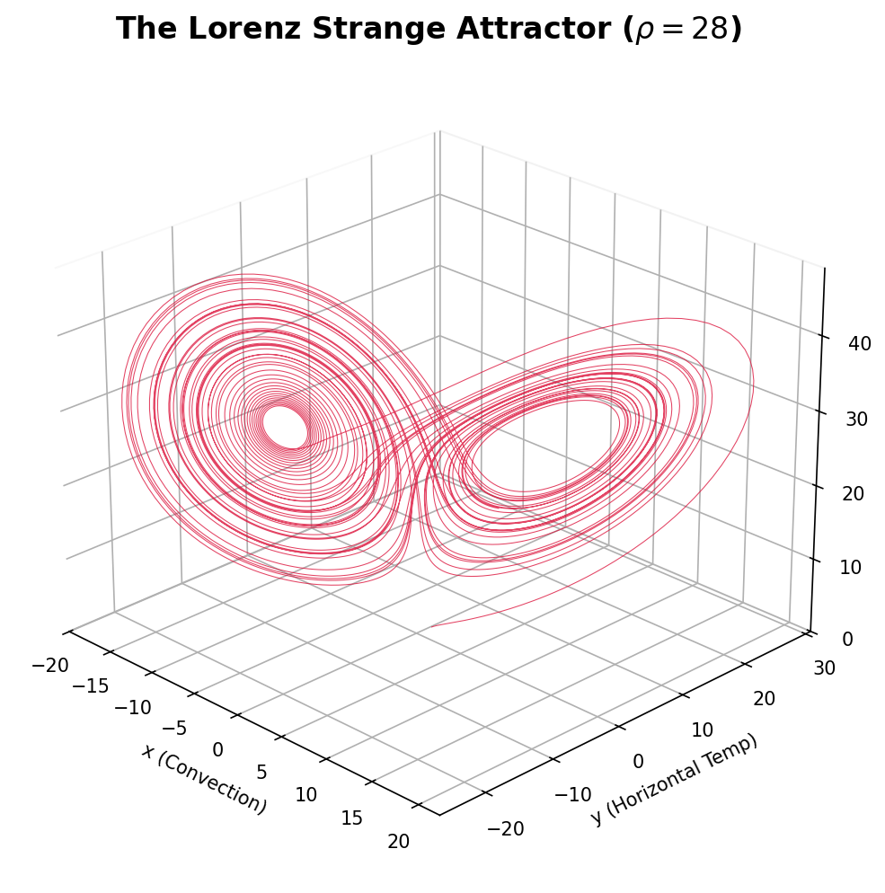

# Lorenz Attractor Simulation: Dissipative Chaos

This repository serves as a numerical laboratory for exploring continuous 3D dissipative chaos. Modeling the Rayleigh-Bénard convection equations, this project visualizes phase space volume contraction, Hopf bifurcations, and the topological bounds of the canonical "Butterfly" strange attractor.

## Repository Focus
Transitioning from conservative Hamiltonian systems, this project utilizes high-order numerical integration to explore non-linear systems where energy is continuously injected and dissipated, forcing infinite trajectories to collapse onto fractal topological manifolds.

## Current Validation: Phase Space Contraction
Before exploring the chaotic regime, the engine's dissipative accuracy was validated below the critical Rayleigh threshold ($\rho < 24.74$). At $\rho = 10$, the system rapidly sheds energy and the initial transient oscillations collapse perfectly into a stable equilibrium (fixed point).



## Phase 2: The Strange Attractor
Transitioning the Rayleigh parameter into the chaotic regime ($\rho = 28$) shatters the stable equilibria. The system continuously evolves along a bounded, non-intersecting fractal manifold, tracing the iconic 3D "Butterfly" wings.



## Project Roadmap
- [x] **Phase 1:** Core Physics Engine & Fixed-Point Validation
- [x] **Phase 2:** 3D Phase Space Kinematics (The Butterfly Attractor)
- [ ] **Phase 3:** 1D Parameter Sweeps & Bifurcation Diagram
- [ ] **Phase 4:** Dissipative Chaos Quantification (Lyapunov Exponents)

## Repository Structure
* `src/`: Contains the core non-linear ODEs in `mechanics.py`.
* `scripts/`: Execution scripts for time-series validation, 3D plotting, and bifurcation sweeping.
* `data/`: Output directory for generated phase-space renders and analytical plots.
* `docs/`: Contains formal mathematical derivations (`theory.md`) and the project timeline (`research_journal.md`).

## Mathematical Foundation
The system integrates the following coupled differential equations:
* $\dot{x} = \sigma (y - x)$
* $\dot{y} = x (\rho - z) - y$
* $\dot{z} = xy - \beta z$

*(For full derivations on phase space volume contraction, see `docs/theory.md`)*

## Getting Started

### Installation
```bash
pip install -r requirements.txt